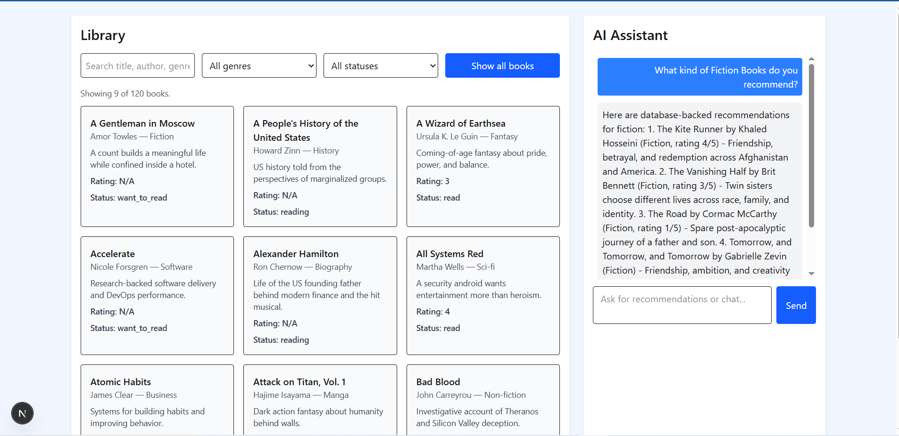

# Week 06 Frontend - BookTracker AI Dashboard

This is a Next.js frontend for the Week 06 Book Tracker project. It displays the book library from the FastAPI backend and includes an AI assistant panel for chat, book recommendations, and agent-powered library updates.



## Features

- Library dashboard with book cards, search, genre filtering, status filtering, and pagination.
- AI assistant chat panel.
- Intent routing that sends recommendation requests, general chat, and book-management requests to the correct backend API.
- Next.js API routes that proxy frontend requests to the Week 06 FastAPI backend.

## Requirements

- Node.js 20+
- npm
- The [week-06-api](https://github.com/calikidd84/week-06-api) backend running locally or at a reachable URL

## Environment Variables

Create a `.env.local` file in the `week-06-frontend` folder before starting the app.

```env
NEXT_PUBLIC_API_URL=http://localhost:8000
```

`NEXT_PUBLIC_API_URL` should point to the Week 06 backend API. Use `http://localhost:8000` when running the backend locally with Docker Compose or `uvicorn`.

The frontend does not need your OpenRouter key directly. AI keys belong in the backend project's `.env` file because the frontend proxies AI requests through the backend.

## Start the Backend

Start the backend first from the [week-06-api](https://github.com/calikidd84/week-06-api) folder/repo:

```bash
docker compose up --build
```

Or run it locally with Python:

```bash
uvicorn main:app --reload
```

The backend should be available at `http://localhost:8000`.

## Start the Frontend

From the `week-06-frontend` folder:

```bash
npm install
npm run dev
```

Open the app at:

```text
http://localhost:3000
```

## Available Scripts

- `npm run dev` starts the Next.js development server.
- `npm run build` builds the production app.
- `npm run start` starts the production build.
- `npm run lint` runs the configured lint command.

## API Connections

The browser talks to local Next.js routes under `/api/*`. Those routes forward requests to the backend URL from `NEXT_PUBLIC_API_URL`.

- `GET /api/books` proxies to `GET /books`.
- `POST /api/ai/chat` proxies to `POST /ai/chat`.
- `POST /api/ai/recommend` proxies to `POST /ai/recommend`.
- `POST /api/ai/agent` proxies to `POST /ai/agent`.

If the frontend shows `Error: could not reach backend`, confirm the backend is running and that `.env.local` points to the correct backend URL.
